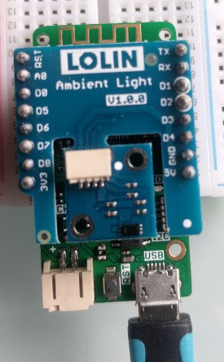

# micropython_BH1750
super simple example use of BH1750 ambient light sensor on the [esp8266 port of micropython](https://micropython.org/download#esp8266)
  i used the [lolin esp8266  D1 mini pro board](https://wiki.wemos.cc/products:d1:d1_mini_pro) and the [BH1750](https://wiki.wemos.cc/products:d1_mini_shields:ambient_light_shield)
   
  
BH1750 library module is from (https://github.com/PinkInk/upylib/tree/master/bh1750) I think
